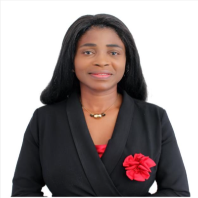
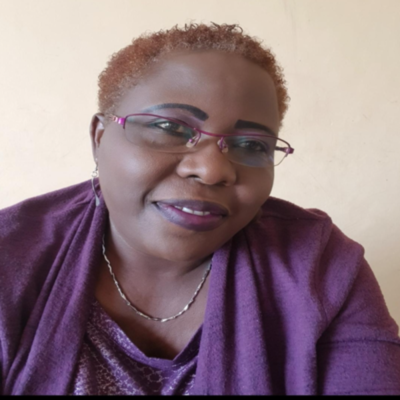
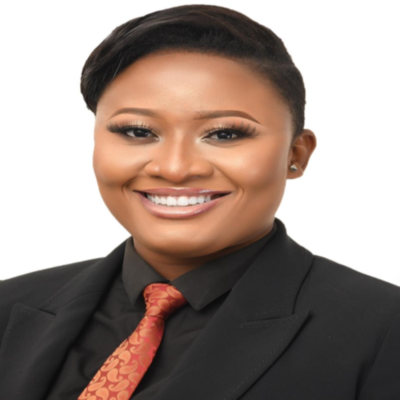

```{css, echo=FALSE}
body {
font-family: Arial, sans-serif;
line-height: 1.6;
color: #333;
}

.center {
display: flex;
justify-content: center;
align-items: center;
flex-direction: column;
}

.center img {
max-width: 100%;
border-radius: 10px;
box-shadow: 0 4px 6px rgba(0, 0, 0, 0.1);
}

h1 {
font-size: 2.5em;
margin-bottom: 10px;
}

p {
font-size: 1.1em;
text-align: justify;
margin-bottom: 20px;
}

a {
color: #1a73e8;
text-decoration: none;
}

a:hover {
text-decoration: underline;
}

.title {
  text-align: center;
}

```


<div class="center">
  <h2>Dr. Rejoice Wodomedzi Foli</h2>
  
  <h3>CEO of G-WEALTH Consults and Senior Project Manager at Absa Bank Ghana Limited</h3>
</div>

Dr. Rejoice Wodomedzi Foli is an accomplished professional and CEO of G-WEALTH Consults, an international firm specializing in Capacity Building Project Management Consulting and Corporate Governance. With over 20 years of experience, she currently serves as the Senior Project Manager at Absa Bank Ghana Limited. Dr. Foli holds impressive credentials, including a DBA, M-PHIL, MBA, CH.PMC, CH.BA, M-IOD, and P-EFA, and is a member of esteemed professional associations such as the Women in Finance and Investment Network (WiFIN), APN-AfCTA Policy Network, and Business Engage Club 30 - GMA South Africa. Recognized as an award-winning Role Model Certified Coach, Mentor, and Consultant, she specializes in Change & Project Management, Human Capital Management, Talent Development, and Transformational Leadership. Dr. Foli is driven by her passion to inspire corporate personalities and foster growth with a positive mindset.

<div class="center">
  <h2>Evelyn M'mera Butich</h2>
  <h3>Lawyer, Consultant, and Researcher</h3>
  
</div>

Evelyn M'mera Butich is a multifaceted professional, being a lawyer, consultant, and researcher with degrees in law, economics, political science, and sociology. She focuses on women's involvement in food and political security, digital entrepreneurship, and science education for disadvantaged girls. Additionally, she investigates sexual crimes and anti-human trafficking policies and is a skilled project evaluator.

<div class="center">
  <h2>Noelyne Mensah</h2>
  <h3>Education, Gender, and Development Consultant</h3>
  
</div>

Noelyne Mensah is a Consultant dedicated to supporting children with learning disabilities and promoting girls' participation in robotics and coding. She is the founder of iGRED Africa and leader of Quepacity Ghana. Noelyne is a self-published author and active participant in youth activism and human rights advocacy. She is passionate about marginalized communities and enjoys sports and quality time with loved ones.
