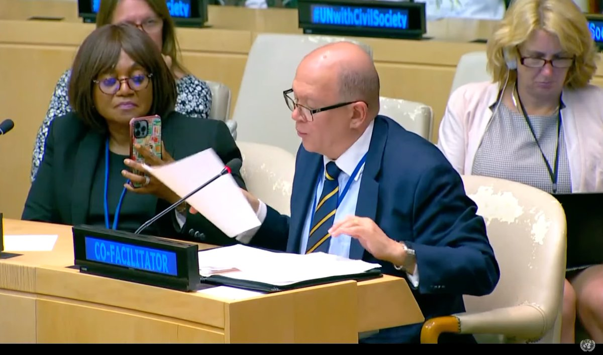

<style>
.title{
display: none;
}
</style>

```{css, echo=FALSE}

.contact-box {
position: relative;
border: 2px solid lightgrey;
padding: 20px;
margin-bottom: 20px;
border-radius: 10px;
background-color: #f9f9f9;
display: block;
width: 100%;
}

.contact-text h2 {
margin-bottom: 10px;
font-size: 1.3em;
margin-right: 50px;
font-weight: bold;
}

.contact-wrapper {
display: flex;
}

.contact-text {
flex-grow: 1;
}

.year {
position: absolute;
top: 10px;
right: 10px;
font-weight: bold;
padding-left: 10px; /* Add left padding to separate the year from the text */
}

.center {
margin-bottom: 20px;           /* This adds some space below the image */
}


h2 {
margin-bottom: 10px;
font-size: 1.3em;
margin-right: 50px; /* Add right margin to separate the title from the year */
}

p {
margin-bottom: 0;
}

.about-us-section {
background-color: #f9f9f9;  /* This adds a background color to the section */
padding: 20px;              /* This adds some padding around the text */
border-radius: 10px;        /* This makes the corners of the section rounded */
margin-top: 20px;           /* This adds some space above the section */
margin-bottom: 20px;        /* This adds some space below the section */
font-family: Arial, sans-serif; /* This changes the font of the text */
}

.about-us-section h2 {
color: #333;  /* This changes the color of the heading */
font-size: 1.5em;  /* This changes the size of the heading */
}

.about-us-section p {
line-height: 1.6;  /* This changes the space between lines of text */
}

```

# Recent Events

<div class="contact-wrapper contact-box">
<div class="center">
<h2>2024 Summit of the Future (<a href="https://twitter.com/undgc_cso/status/1673737596466257920">link</a>)</h2>

</div>
</div>


<div class="contact-wrapper contact-box">
<div class="contact-text">
<h2>Towards Closing the Gender Gap in Science, Technology, and Innovation in Developing Countries</h2>
<span class="year">2023</span>
<p>On the margins of the CSW67 in March 2023, Barrister Eze hosted a high level side event with the Permanent Mission of Malawi to the United Nations, Office Of The Special Adviser Of The Secretary General on Africa, International Telecommunications Union and the Commissioner Of International Affairs, New York City’s Office on this topic.</p>
</div>
</div>

<div class="contact-wrapper contact-box">
<div class="contact-text">
<h2>Food Security Response: Combatting Illicit Financial Flows And Securing Asset Returns For Sustainable Development</h2>
<span class="year">2022</span>
<p>As part of the 77th Session of the United Nations General Assembly, Barrister Eze moderated this High Level panel discussion hosted by The African Union, NEPAD, African Peer Review Mechanism, The Government of the Federal Republic of Nigeria and the Economic and Financial Crimes Commission (EFCC).</p>
</div>
</div>

<div class="contact-wrapper contact-box">
<div class="contact-text">
<h2>Strengthening Resilience And Sustaining Development: A Humanitarian Approach To Leaving No One Behind</h2>
<span class="year">2022</span>
<p>On the margins of the 77th Session of the United Nations General Assembly in September 2022, Barrister Eze moderated this High Level panel discussion organized by the Ministry Of Humanitarian Affairs, Disaster Management, and Social Development, Nigeria.</p>
</div>
</div>

<div class="contact-wrapper contact-box">
<div class="contact-text">
<h2>Building Back Better From The Coronavirus Disease ( COVID19 ) While Advancing The Full Implementation Of The 2030 Agenda For Sustainable Development.</h2>
<span class="year">2022</span>
<p>In July 2022, she was a Lead discussant at the United Nations High Level Political Forum On Sustainable Development in this session.</p>
</div>
</div>

<div class="contact-wrapper contact-box">
<div class="contact-text">
<h2>The Role Of Artificial Intelligence In Achieving Food Security In The Post COVID-19 Era: Investing In A Safe , Nutritious And Climate - Resilient Food System.</h2>
<span class="year">2021</span>
<p>On the margins of the 2021 United Nations Food Systems Summit, Barrister Eze hosted a virtual event on Food Insecurity and Artificial Intelligence.</p>
</div>
</div>

<div class="contact-wrapper contact-box">
<div class="contact-text">
<h2>Building Back Better : Risk- Informed COVID -19 Recovery And Rehabilitation And Strengthening Resilience To Climate Change - Related Disasters In Africa And The Caribbean.</h2>
<span class="year">2021</span>
<p>Ugoji Adanma Eze conceptualized and moderated a virtual High Level meeting at the United Nations, New York on this theme.</p>
</div>
</div>

<div class="contact-wrapper contact-box">
<div class="contact-text">
<h2>Antisemitism: A Threat To International Peace And Security</h2>
<span class="year">2014</span>
<p>Barrister Eze hosted an event at the United Nations in response to the emergence of Antisemitism and related intolerance in Europe.</p>
</div>
</div>


