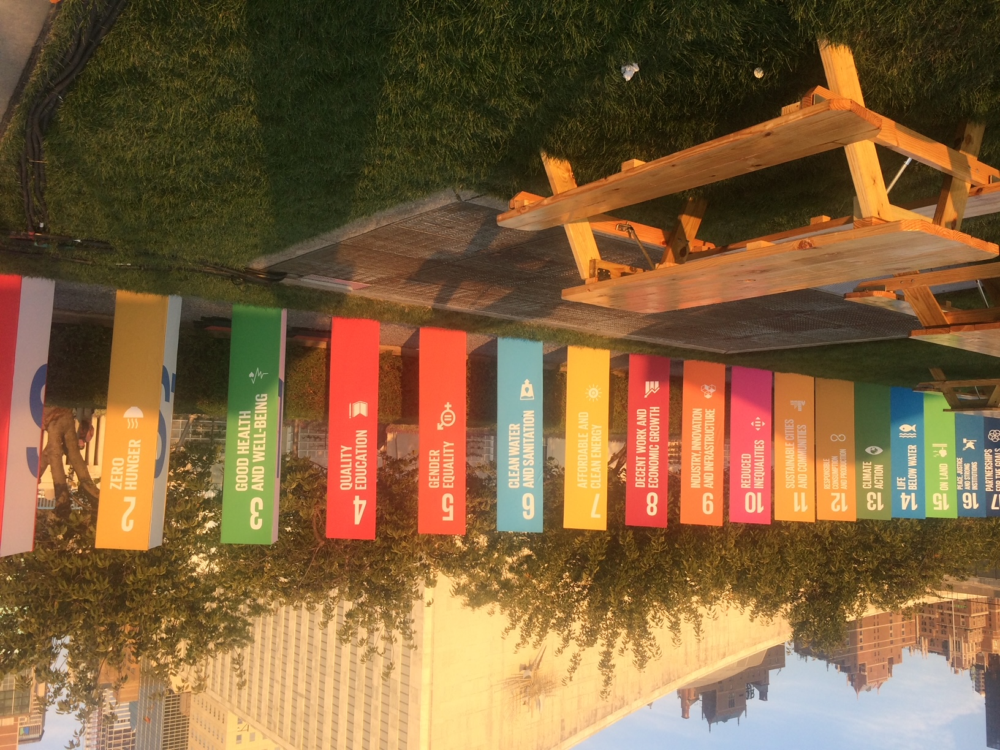

<style>
.title{
display: none;
}
</style>

```{css, echo=FALSE}

.contact-box {
position: relative;
border: 2px solid lightgrey;
padding: 20px;
margin-bottom: 20px;
border-radius: 10px;
background-color: #f9f9f9;
display: block;
width: 100%;
}

.contact-text h2 {
margin-bottom: 10px;
font-size: 1.3em;
margin-right: 50px;
font-weight: bold;
}

.contact-wrapper {
display: flex;
}

.contact-text {
flex-grow: 1;
}

.year {
position: absolute;
top: 10px;
right: 10px;
font-weight: bold;
padding-left: 10px; /* Add left padding to separate the year from the text */
}

.center {
margin-bottom: 20px;           /* This adds some space below the image */
}


h2 {
margin-bottom: 10px;
font-size: 1.3em;
margin-right: 50px; /* Add right margin to separate the title from the year */
}

p {
margin-bottom: 0;
}

.about-us-section {
background-color: #f9f9f9;  /* This adds a background color to the section */
padding: 20px;              /* This adds some padding around the text */
border-radius: 10px;        /* This makes the corners of the section rounded */
margin-top: 20px;           /* This adds some space above the section */
margin-bottom: 20px;        /* This adds some space below the section */
font-family: Arial, sans-serif; /* This changes the font of the text */
}


.about-us-section h2 {
color: #333;  /* This changes the color of the heading */
font-size: 1.5em;  /* This changes the size of the heading */
}

.about-us-section p {
line-height: 1.6;  /* This changes the space between lines of text */
}

```

<div class="center">

</div>

# Mission & Values
<div class="about-us-section">
<h2>About Us</h2>
<p>
At Mishkan Holdings LLC, our mission is to serve our clients by creating and developing high-level forums at the international level. We aim to bring complex projects and ideas to life, boosting our clients' performance with our expertise in diplomacy and international relations.
</p>

<p>
Our innovative consultancy services have made significant impacts on the international community. Our commitment to Corporate Social Responsibility (CSR) manifests itself in three key areas:
</p>

<ul>
<li>Being an excellent partner</li>
<li>Being a responsible employer</li>
<li>Being a committed player</li>
</ul>

<h2>Our Work</h2>
<p>
We highlight important issues at the United Nations Headquarters in New York, bringing them to the attention of a global audience through high-level interactive forums. Our team is skilled at transforming creative ideas into innovative and informative high-level forums and interactive panel discussions.
</p>

<p>
Over the years, we have contributed to major high-level events at the United Nations Headquarters, including:
</p>

<ul>
<li>"Global Anti-Semitism: A Threat to International Peace and Security"</li>
<li>"The Persecution of Christians in the Middle East: A Threat to International Peace and Security"</li>
<li>"The Impact of Small Arms and Light Weapons on Women and Girls in Latin America and the Caribbean: Profile in Courageous Women and Girls"</li>
<li>"The Impact of War on Children and Youths in Conflict Zones"</li>
</ul>

<h2>Our Commitment</h2>
<p>
As a privileged innovation partner to the international community, our core value is to better serve our clients. We are a global leader in our field, offering dynamic and innovative consultancy services.
</p>
</div>

```{r setup, include=FALSE}
knitr::opts_chunk$set(echo = TRUE)
options(knitr.duplicate.label = "allow")
```

```{r, render, echo = FALSE, include=FALSE}

rmarkdown::render("technical_team.Rmd")

rmarkdown::render("initiatives.Rmd")

rmarkdown::render("consultants.Rmd")

rmarkdown::render("events.Rmd")

# rmarkdown::render("dca-tutorial.Rmd")
# 
# rmarkdown::render("dca-tutorial.Rmd",
#                  params = list(language = "r"),
#                  output_file = "dca-tutorial-r.html")
# rmarkdown::render("dca-tutorial.Rmd",
#                  params = list(language = "stata"),
#                  output_file = "dca-tutorial-stata.html")
# rmarkdown::render("dca-tutorial.Rmd",
#                  params = list(language = "sas"),
#                  output_file = "dca-tutorial-sas.html")
# rmarkdown::render("dca-tutorial.Rmd",
#                  params = list(language = "python"),
#                  output_file = "dca-tutorial-python.html")
# rmarkdown::render("literature.Rmd")
# rmarkdown::render("resources.Rmd")
```


