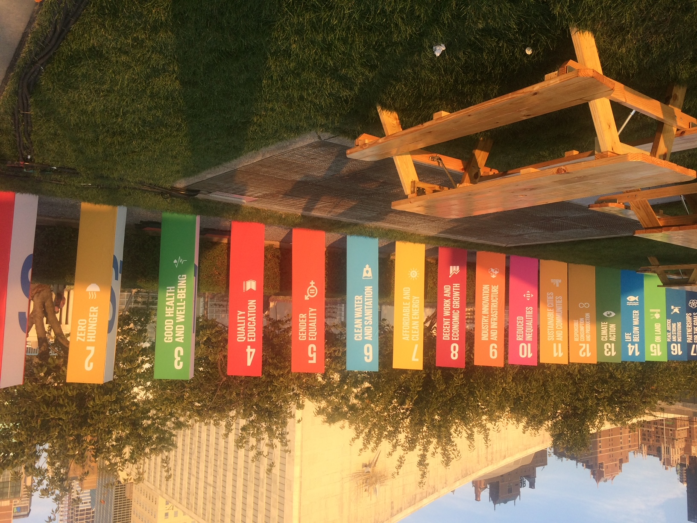
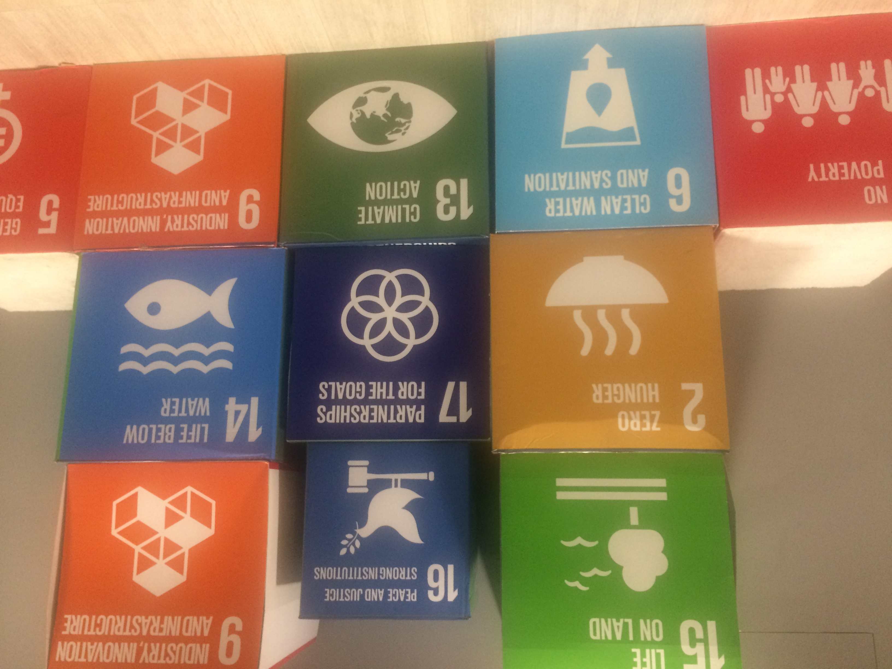

<style>
.title{
  display: none;
}
</style>

```{css, echo=FALSE}
body {
  font-family: Arial, sans-serif;
  line-height: 1.6;
  color: #333;
}

.center {
  display: flex;
  justify-content: center;
  align-items: center;
  flex-direction: column;
}

.center img {
  max-width: 100%;
  border-radius: 10px;
  box-shadow: 0 4px 6px rgba(0, 0, 0, 0.1);
}

h1 {
  font-size: 2.5em;
  margin-bottom: 10px;
}

p {
  font-size: 1.1em;
  text-align: justify;
  margin-bottom: 20px;
}

a {
  color: #1a73e8;
  text-decoration: none;
}

a:hover {
  text-decoration: underline;
}
```

<div class="center">
  <h2>Mishkin Holdings, LLC</h2>
  
</div>

<!-- <div class="center"> -->
<!--   <h2>Mishkin Holdings, LLC</h2> -->
<!--    -->
<!-- </div> -->

Mission and Values:

Why choose us? Our innovative consultancy has made significant impacts on the international community. We are committed to Corporate Social Responsibility (CSR) in the following areas:

Being an excellent partner.
Being a responsible employer.
Being a committed player.
We offer unique and innovative consultancy services where we turn creative ideas into reality. Our mission is to serve our clients by helping them create and develop high-level forums at the international level. We bring complex projects and ideas to life, boosting our clients' performance with our expertise in diplomacy and international relations.

We highlight important issues at the United Nations Headquarters in New York, bringing them to the attention of a global audience by hosting high-level interactive forums. We transform creative ideas into innovative and informative high-level forums and interactive panel discussions at the United Nations Headquarters.

Mishkan Holdings LLC has contributed to some of the major high-level events at the United Nations Headquarters in recent years, including "Global Anti-Semitism: A Threat to International Peace and Security", "The Persecution of Christians in the Middle East: A Threat to International Peace and Security", "The Impact of Small Arms and Light Weapons on Women and Girls in Latin America and the Caribbean: Profile in Courageous Women and Girls", and "The Impact of War on Children and Youths in Conflict Zones".

As a privileged innovation partner to the international community, our core value is to better serve our clients. We are a global leader in our field, offering dynamic and innovative consultancy services.


```{r setup, include=FALSE}
  knitr::opts_chunk$set(echo = TRUE)
  options(knitr.duplicate.label = "allow")
```

```{r, render, echo = FALSE, include=FALSE}
  # rmarkdown::render("dca-tutorial.Rmd")
  # 
  # rmarkdown::render("dca-tutorial.Rmd",
  #                  params = list(language = "r"),
  #                  output_file = "dca-tutorial-r.html")
  # rmarkdown::render("dca-tutorial.Rmd",
  #                  params = list(language = "stata"),
  #                  output_file = "dca-tutorial-stata.html")
  # rmarkdown::render("dca-tutorial.Rmd",
  #                  params = list(language = "sas"),
  #                  output_file = "dca-tutorial-sas.html")
  # rmarkdown::render("dca-tutorial.Rmd",
  #                  params = list(language = "python"),
  #                  output_file = "dca-tutorial-python.html")
  # rmarkdown::render("literature.Rmd")
  # rmarkdown::render("resources.Rmd")
```


