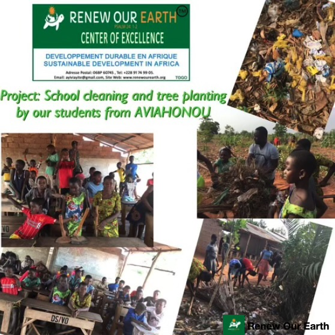
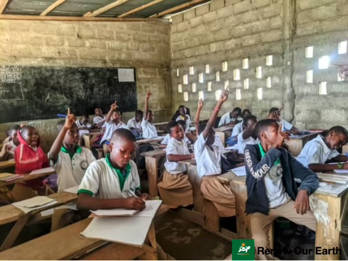

```{r setup, include=FALSE}
knitr::opts_chunk$set(echo = TRUE)
```

```{css, echo=FALSE}
body {
font-family: Arial, sans-serif;
line-height: 1.6;
color: #333;
}

.center {
display: flex;
justify-content: center;
align-items: center;
flex-direction: column;
}

.center img {
max-width: 100%;
border-radius: 10px;
box-shadow: 0 4px 6px rgba(0, 0, 0, 0.1);
}

h1 {
font-size: 2.5em;
margin-bottom: 10px;
}

p {
font-size: 1.1em;
text-align: justify;
margin-bottom: 20px;
}

a {
color: #1a73e8;
text-decoration: none;
}

a:hover {
text-decoration: underline;
}

.title {
  text-align: center;
}

```

<div class="center">
  <h2><a href="https://renewourearth.org/">Renew Our Earth Center of Excellence</a></h2>
  
</div>


<div class="center">
  
</div>


