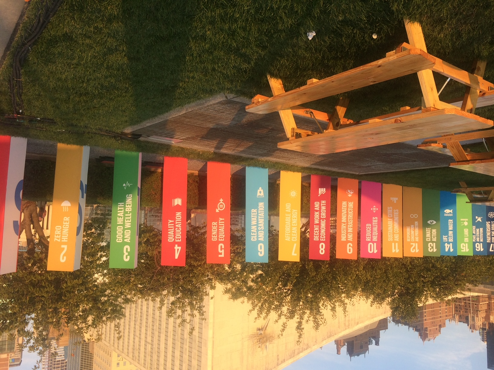

```{css, echo=FALSE}
body {
  font-family: Arial, sans-serif;
  line-height: 1.6;
  color: #333;
}

.center {
  display: flex;
  justify-content: center;
  align-items: center;
  flex-direction: column;
}

.center img {
  max-width: 100%;
  border-radius: 10px;
  box-shadow: 0 4px 6px rgba(0, 0, 0, 0.1);
}

h1 {
  font-size: 2.5em;
  margin-bottom: 10px;
}

p {
  font-size: 1.1em;
  text-align: justify;
  margin-bottom: 20px;
}

a {
  color: #1a73e8;
  text-decoration: none;
}

a:hover {
  text-decoration: underline;
}
```

<!-- <div class="center"> -->
<!--    -->
<!-- </div> -->

UGOJI ADANMA EZE, Esq., PhD, FEGSB, is the founder of our technical team. With a robust background in law and extensive experience in international affairs, she has made significant contributions across various fields. Ugoji has authored several publications on diverse topics such as human rights, nuclear terrorism, female suicide bombers, cyber security, and the US commitment to refugees. She has served as the Focal Point of the Commission on the Status of Women NGO Women Peace and Security and is actively involved in organizations such as the International Association of Jewish Lawyers and Jurists, the Nigeria Bar Association, and the New York City Bar. Ugoji has spoken at numerous prestigious events, including those at the United Nations and Columbia University. Her expertise and dedication make her a valuable asset to our technical team.

<div class="center">
  
</div>

H.E. Laila Rahhal El Atfani is a renowned professional and entrepreneur known for her impactful work in various fields. She is the President and Founder of Business Gate, the I AM AFRICA platform, and Woman Business Circle. Laila has a strong media presence and is recognized as a Goodwill Ambassador and an International Ambassador of Peace and Tolerance. She holds prestigious positions such as the Head of Protocol and Diplomacy at AACID and WPC, and she's actively involved in organizations like REFAI NGO and MACAN Fuel & Petroleum Trading. Dedicated to empowering women and youth, Laila has served as the President of the Economic Platform, United Youth Circuit, and Women Empowerment and International Relations with Anwour Association in Morocco. She has received numerous commendations for her inspiring leadership and commitment to societal betterment.

<div class="center">
  
</div>

Dr. Rejoice Wodomedzi Foli is an accomplished professional and CEO of G-WEALTH Consults, an international firm specializing in Capacity Building Project Management Consulting and Corporate Governance. With over 20 years of experience, she currently serves as the Senior Project Manager at Absa Bank Ghana Limited. Dr. Foli holds impressive credentials, including a DBA, M-PHIL, MBA, CH.PMC, CH.BA, M-IOD, and P-EFA, and is a member of esteemed professional associations such as the Women in Finance and Investment Network (WiFIN), APN-AfCTA Policy Network, and Business Engage Club 30 - GMA South Africa. Recognized as an award-winning Role Model Certified Coach, Mentor, and Consultant, she specializes in Change & Project Management, Human Capital Management, Talent Development, and Transformational Leadership. Dr. Foli is driven by her passion to inspire corporate personalities and foster growth with a positive mindset.

Shaun Porwal, based in New York, is a Biomedical Data Scientist with a B.E. in Biomedical Engineering from Rutgers University and an M.S. in Biomedical Data Science from Mount Sinai. He currently serves as a Data Analyst and Research Biostatistician at Memorial Sloan Kettering Cancer Center. He brought clinical model evaluation to the Python community by writing the 'dcurves' package based on Decision Curve Analysis, and routinely contributes to statistical sections in urological cancer publications. Shaun has extensive experience from roles at Sema4 and Rutgers University, developing algorithms for time-series gene expression and performing structural variant detection on large data sets. He's proficient in several programming languages, including Python & R, and is multilingual, speaking English, Hindi, Mandarin, and Japanese. Outside of work, Shaun enjoys exploring languages, traveling, and running.

